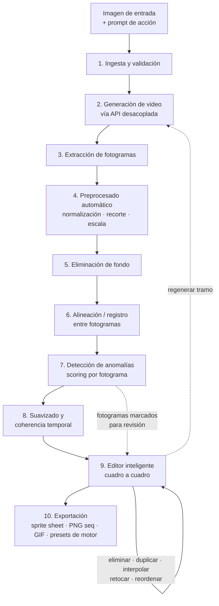
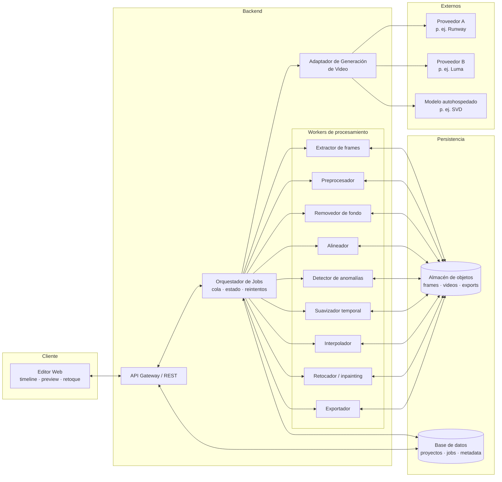
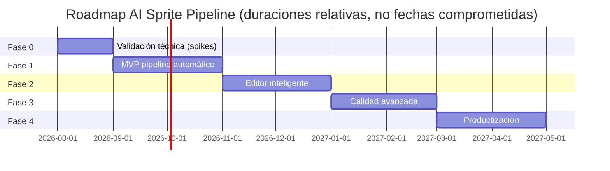

# AI Sprite Pipeline — Documento de Planificación Fundacional

**Versión:** 0.1 · **Fecha:** 2026-08-06 · **Estado:** Borrador fundacional para aprobación
**Autores del rol:** Product Manager Senior + Arquitecto de Software

---

## Índice

1. [Visión y objetivos](#1-visión-y-objetivos)
2. [Flujo end-to-end del producto](#2-flujo-end-to-end-del-producto)
3. [Arquitectura modular escalable](#3-arquitectura-modular-escalable)
4. [Historias de usuario](#4-historias-de-usuario)
5. [Roadmap por fases](#5-roadmap-por-fases)
6. [Tecnologías sugeridas: pros y contras](#6-tecnologías-sugeridas-pros-y-contras)
7. [Riesgos técnicos y mitigaciones](#7-riesgos-técnicos-y-mitigaciones)
8. [Métricas de éxito](#8-métricas-de-éxito)
9. [Glosario](#9-glosario)

---

## 1. Visión y objetivos

### 1.1 El problema

Producir animaciones de sprites para videojuegos es uno de los cuellos de botella más caros del desarrollo indie y de equipos pequeños: cada ciclo de animación (caminar, saltar, atacar, morir) exige dibujar, alinear y limpiar decenas de fotogramas a mano. Los modelos generativos de video ya producen movimiento plausible a partir de una imagen, pero su salida cruda es **inutilizable directamente como sprite**: fondos inconsistentes, deriva de posición y escala, fotogramas corruptos, pérdida de identidad del personaje y ausencia de transparencia.

Hoy, quien intenta usar IA para esto termina haciendo el trabajo manual igualmente — solo que en un editor de imágenes, cuadro a cuadro.

### 1.2 La propuesta de valor

**AI Sprite Pipeline** convierte una imagen de un personaje en un sprite animado listo para motor de juego, automatizando todo lo automatizable y asistiendo con IA lo que requiere criterio humano.

> **Una imagen + una acción ("caminar hacia la derecha") → un sprite sheet exportado, con la mínima edición manual posible.**

El producto se diferencia en tres decisiones de diseño:

1. **Generación desacoplada.** El modelo de video generativo es un proveedor intercambiable detrás de una interfaz adaptadora. El valor del producto no está en generar el video, sino en **todo lo que ocurre después**: la limpieza, alineación, control de calidad y edición asistida que convierten video crudo en asset de juego.
2. **Pipeline automático primero, editor después.** El objetivo es que el resultado automático sea "casi utilizable" y el editor solo intervenga en excepciones detectadas por el propio sistema.
3. **El editor es inteligente, no un editor de imágenes.** Opera a nivel de *secuencia de animación*: eliminar, duplicar, interpolar y retocar cuadros con contexto temporal, no píxeles sueltos.

### 1.3 Objetivos del producto

| # | Objetivo | Medible por |
|---|----------|-------------|
| O1 | Reducir el tiempo de imagen → sprite exportado a minutos | Tiempo total del flujo (métrica M2) |
| O2 | Minimizar la intervención manual por animación | Nº de acciones de edición por ciclo (M3) |
| O3 | Independencia de proveedores de generación de video | Cambio de proveedor sin tocar el resto del pipeline |
| O4 | Salida directamente consumible por motores de juego comunes | Import sin retrabajo en Unity/Godot/Phaser |

### 1.4 Alcance y no-objetivos

**Dentro del alcance (fase fundacional):**
- Sprites de personajes 2D a partir de una imagen de entrada + descripción de la acción.
- Pipeline completo: generación → extracción → preprocesado → fondo → alineación → anomalías → suavizado → edición → exportación.
- Exportación a formatos estándar (sprite sheet + metadata, secuencia PNG, GIF).

**Fuera del alcance (no-objetivos explícitos):**
- **No** es un editor de arte de propósito general (no compite con Aseprite/Photoshop).
- **No** entrena ni ajusta modelos generativos propios en la fase fundacional; consume APIs/modelos existentes.
- **No** cubre animación esquelética/rigging 2D (Spine, Live2D) — solo animación por fotogramas.
- **No** cubre tilesets, escenarios ni UI de juego; solo personajes/entidades animadas.
- Pixel-art estricto (rejilla de píxeles perfecta) se trata como extensión futura, no como garantía del MVP (ver riesgo R8).

### 1.5 Caso de uso inicial (dogfooding)

El primer consumidor del pipeline es el proyecto **tamagochi_ia**: una mascota virtual con IA cuya criatura necesita ciclos de animación (idle, comer, dormir, jugar, enfermarse). Este caso de uso real acota el MVP: pocos personajes, muchas acciones por personaje, estilo consistente, y tolerancia a iterar. El producto, no obstante, se diseña como herramienta genérica para cualquier desarrollador de juegos 2D.

### 1.6 Usuarios objetivo

| Persona | Necesidad | Implicación de producto |
|---------|-----------|-------------------------|
| Dev indie sin artista | Animaciones "suficientemente buenas" rápido | Automatización máxima, defaults sensatos |
| Artista 2D que prototipa | Iterar variantes de movimiento antes de dibujar a mano | Editor con control fino, exportación de referencia |
| Estudio pequeño | Volumen de assets con estilo consistente | Proyectos, presets, procesamiento por lotes (fases tardías) |

---

## 2. Flujo end-to-end del producto

### 2.1 Diagrama del flujo

### 2.2 Narrativa del flujo

1. **Ingesta.** El usuario sube una imagen del personaje (idealmente fondo neutro, cuerpo completo) y describe la acción deseada. El sistema valida resolución, formato y encuadre, y sugiere correcciones antes de gastar una generación.
2. **Generación de video (desacoplada).** El orquestador construye un prompt optimizado (personaje estático de cámara, fondo uniforme, acción en bucle) y lo envía al proveedor configurado a través del **adaptador de generación**. El job es asíncrono: se encola, se consulta estado y se reintenta ante fallos transitorios.
3. **Extracción de fotogramas.** Del video resultante se extraen fotogramas a una tasa configurable (p. ej. 8–12 fps efectivos para sprites), con deduplicación de cuadros casi idénticos.
4. **Preprocesado automático.** Normalización de tamaño y espacio de color, recorte al área de interés, detección del sujeto para centrar el encuadre de trabajo.
5. **Eliminación de fondo.** Segmentación del personaje en cada fotograma para producir canal alfa limpio. Se aplican heurísticas de consistencia: la máscara de un fotograma informa a la del siguiente para evitar parpadeos de silueta.
6. **Alineación / registro.** Los fotogramas se registran entre sí (ancla configurable: pies, centro de masa, bounding box) para eliminar la deriva de posición y escala típica del video generado, de modo que la animación no "flote" dentro del canvas.
7. **Detección de anomalías.** Cada fotograma recibe un puntaje de calidad: similitud de identidad respecto a la imagen original, coherencia con vecinos, artefactos (extremidades extra, deformaciones, ghosting). Los fotogramas bajo umbral se **marcan**, no se eliminan silenciosamente.
8. **Suavizado y coherencia temporal.** Estabilización de color/iluminación entre cuadros, suavizado de bordes del alfa, y normalización del timing (curva de tiempos uniforme o easing).
9. **Editor inteligente cuadro a cuadro.** El usuario ve la secuencia como timeline con previsualización en bucle. Los fotogramas marcados por el detector aparecen destacados. Acciones disponibles:
   - **Eliminar** un cuadro (el timing se recalcula).
   - **Duplicar** un cuadro (para sostener poses).
   - **Interpolar**: generar un cuadro intermedio entre dos existentes (para tapar el hueco de uno eliminado o ganar fluidez).
   - **Retoque puntual**: inpainting asistido sobre una región de un cuadro (borrar un artefacto, corregir una mano) usando cuadros vecinos como referencia.
   - **Reordenar** y ajustar duración por cuadro.
   - **Regenerar tramo**: volver a pedir al proveedor solo un segmento de la acción.
10. **Exportación.** Sprite sheet empaquetado + metadata JSON (frames, duraciones, anclas, pivotes), secuencia PNG numerada, GIF/APNG de previsualización, y presets de importación para motores comunes.

### 2.3 Principio de "excepción visible"

Regla transversal de UX: **el pipeline nunca descarta contenido en silencio ni exige revisar todo**. Todo lo automático es reversible y auditable; todo lo dudoso se marca para que el humano decida. Así se minimiza la edición manual sin sacrificar control.

---

## 3. Arquitectura modular escalable

### 3.1 Principios rectores

1. **Pipeline de etapas con contratos explícitos.** Cada módulo consume y produce *artefactos* (imágenes/video) + *metadata* (JSON) con esquema versionado. Ningún módulo conoce la implementación interna de otro.
2. **El proveedor de generación es un plugin.** Interfaz `VideoGenerationProvider` con operaciones de enviar job, consultar estado y recuperar resultado; cada proveedor (Runway, Luma, Kling, modelo autohospedado) es una implementación registrable. Cambiar de proveedor es configuración, no código.
3. **Asincronía por defecto.** La generación tarda decenas de segundos a minutos; todo el pipeline se modela como jobs encolados con estado consultable, no como llamadas bloqueantes.
4. **Idempotencia y cacheo de intermedios.** Cada etapa puede re-ejecutarse sobre los artefactos de la anterior sin repetir el pipeline completo (crítico para iterar en el editor sin regenerar video, que es la etapa cara).
5. **El editor es un cliente del pipeline, no su dueño.** Las operaciones del editor (interpolar, retocar) invocan los mismos módulos de procesamiento vía API; no hay lógica de imagen duplicada en el frontend.

### 3.2 Diagrama de componentes

### 3.3 Catálogo de módulos y contratos

| Módulo | Responsabilidad | Entrada | Salida |
|--------|-----------------|---------|--------|
| **Ingesta/Validación** | Validar imagen y parámetros; feedback previo al gasto | Imagen + prompt de acción | `SourceAsset` + advertencias |
| **Adaptador de Generación** | Abstraer proveedores de video; traducir prompt y parámetros | `GenerationRequest` | `GenerationJob` → video crudo |
| **Orquestador de Jobs** | Encolar, monitorizar, reintentar, encadenar etapas | Definición de pipeline | Estados + eventos de progreso |
| **Extractor de frames** | Muestrear fotogramas del video; deduplicar | Video crudo + fps objetivo | `FrameSet` v0 (crudo) |
| **Preprocesador** | Normalizar tamaño/color; recorte al sujeto | `FrameSet` v0 | `FrameSet` v1 (normalizado) |
| **Removedor de fondo** | Segmentar personaje; alfa consistente entre cuadros | `FrameSet` v1 | `FrameSet` v2 (RGBA) + máscaras |
| **Alineador** | Registrar cuadros contra ancla común; corregir deriva | `FrameSet` v2 + ancla | `FrameSet` v3 + transformaciones |
| **Detector de anomalías** | Puntuar calidad e identidad por cuadro; marcar sospechosos | `FrameSet` v3 + imagen original | Scores + flags por cuadro |
| **Suavizador temporal** | Estabilizar color/bordes/timing entre cuadros | `FrameSet` v3 + scores | `FrameSet` v4 (final automático) |
| **Interpolador** | Sintetizar cuadro intermedio entre dos dados | Par de cuadros | Cuadro nuevo |
| **Retocador (inpainting)** | Corregir región de un cuadro con contexto de vecinos | Cuadro + máscara + vecinos | Cuadro corregido |
| **Editor (UI)** | Timeline, preview, operaciones de secuencia | `FrameSet` v4 + flags | `EditSession` (lista de operaciones) |
| **Exportador** | Empaquetar sprite sheet, metadata y presets | `FrameSet` final + `EditSession` | Artefactos de exportación |
| **Proyectos/Versionado** | Persistir proyectos, animaciones, historial | Todos los artefactos | Estado recuperable |

**Convención de metadata:** cada `FrameSet` viaja con un manifiesto JSON (`frameset.json`) que registra procedencia (proveedor, prompt, versión de cada etapa aplicada), orden, duraciones, anclas y flags — el mismo manifiesto alimenta al editor y al exportador.

### 3.4 Escalabilidad y evolución

- **Horizontal por etapa:** cada worker es independiente y sin estado; se escala el que sea cuello de botella (típicamente segmentación e interpolación) sin tocar el resto.
- **De monolito modular a servicios:** el MVP puede desplegarse como un solo proceso con cola embebida; los límites de módulo ya definidos permiten extraer workers a servicios separados cuando el volumen lo exija, sin rediseño.
- **Multi-tenant preparado, no implementado:** los esquemas de datos incluyen `project_id`/`user_id` desde el día uno; autenticación y cuotas llegan en Fase 4.
- **Costes bajo control:** la etapa de generación (la única con coste externo por uso) está aislada; cacheo de resultados + regeneración parcial por tramos evita pagar el video completo en cada iteración.

---

## 4. Historias de usuario

Priorización MoSCoW: **[M]** Must · **[S]** Should · **[C]** Could. Agrupadas por épica.

### Épica A — Generación

- **A1 [M]** Como desarrollador, quiero subir una imagen de mi personaje y describir una acción, para obtener un video de esa acción sin escribir prompts técnicos.
  *Criterios:* acepta PNG/JPG/WebP; valida resolución mínima; el sistema enriquece el prompt (fondo uniforme, cámara fija) sin que el usuario lo pida.
- **A2 [M]** Como usuario, quiero ver el estado de mi generación (en cola, generando, procesando, lista), para saber cuándo intervenir.
  *Criterios:* estados visibles en tiempo casi real; errores del proveedor se muestran con causa y opción de reintento.
- **A3 [S]** Como usuario, quiero elegir entre varios resultados de generación (semillas/variantes), para quedarme con el movimiento que mejor encaja.
- **A4 [S]** Como administrador del sistema, quiero cambiar el proveedor de generación por configuración, para no depender de un único servicio.
  *Criterios:* cambio sin modificar código de otros módulos; los proyectos registran con qué proveedor se generó cada animación.

### Épica B — Procesamiento automático

- **B1 [M]** Como usuario, quiero que los fotogramas se extraigan, recorten y normalicen automáticamente, para no tocar un editor de video.
  *Criterios:* fps objetivo configurable con default sensato; cuadros duplicados consecutivos se eliminan automáticamente.
- **B2 [M]** Como usuario, quiero el fondo eliminado en todos los cuadros con transparencia limpia, para usar el sprite sobre cualquier escenario.
  *Criterios:* alfa sin halos visibles a escala 1x; la silueta no parpadea entre cuadros consecutivos.
- **B3 [M]** Como usuario, quiero que el personaje quede alineado entre cuadros, para que la animación no flote ni cambie de tamaño.
  *Criterios:* ancla seleccionable (pies/centro); deriva residual < 2 % del alto del sprite.
- **B4 [M]** Como usuario, quiero que el sistema detecte y marque los cuadros defectuosos, para revisar solo lo dudoso en lugar de toda la secuencia.
  *Criterios:* cada cuadro tiene score visible; umbral ajustable; nada se borra sin confirmación.
- **B5 [S]** Como usuario, quiero un pase de suavizado de color e iluminación entre cuadros, para que la animación no "pulse".

### Épica C — Revisión y edición (editor inteligente)

- **C1 [M]** Como usuario, quiero ver mi animación en bucle junto a un timeline de cuadros, para evaluar el movimiento de un vistazo.
  *Criterios:* preview a velocidad real y a cámara lenta; cuadros marcados por el detector destacados visualmente.
- **C2 [M]** Como usuario, quiero eliminar un cuadro defectuoso, para limpiar la secuencia en un clic.
- **C3 [M]** Como usuario, quiero duplicar un cuadro y ajustar su duración, para sostener poses clave.
- **C4 [M]** Como usuario, quiero generar un cuadro interpolado entre dos existentes, para reemplazar un cuadro eliminado o ganar fluidez.
  *Criterios:* la interpolación respeta el canal alfa; el cuadro nuevo pasa por el detector de anomalías.
- **C5 [M]** Como usuario, quiero retocar una región puntual de un cuadro (p. ej. una mano deforme) con inpainting asistido, para no salir a un editor externo.
  *Criterios:* selección por pincel/lazo; el relleno usa cuadros vecinos como referencia de identidad; historial de deshacer.
- **C6 [S]** Como usuario, quiero reordenar cuadros arrastrándolos en el timeline, para corregir el ritmo de la acción.
- **C7 [S]** Como usuario, quiero regenerar solo un tramo de la animación, para no perder los cuadros buenos al reintentar.
- **C8 [C]** Como usuario, quiero comparar "antes/después" de cada paso automático, para confiar en lo que el pipeline hizo por mí.

### Épica D — Exportación

- **D1 [M]** Como desarrollador, quiero exportar un sprite sheet con su metadata JSON (frames, duraciones, pivotes), para importarlo en mi motor sin retrabajo.
  *Criterios:* empaquetado con padding configurable; metadata compatible con formato tipo TexturePacker/Aseprite.
- **D2 [M]** Como usuario, quiero exportar la secuencia como PNGs numerados y como GIF de previsualización, para compartir y probar rápido.
- **D3 [S]** Como desarrollador, quiero presets de exportación para Unity, Godot y Phaser, para que el import sea de un paso.
- **D4 [C]** Como artista, quiero exportar a escalas múltiples (1x/2x/4x) con reescalado apropiado, para distintos targets de resolución.

### Épica E — Gestión de proyectos

- **E1 [M]** Como usuario, quiero organizar animaciones por personaje y proyecto, para mantener juntos todos los ciclos de una misma criatura.
- **E2 [S]** Como usuario, quiero historial de versiones por animación, para volver a un estado anterior tras una mala edición.
- **E3 [C]** Como usuario, quiero duplicar una animación como punto de partida de otra, para reutilizar configuración y estilo.

---

## 5. Roadmap por fases

### Fase 0 — Validación técnica (spikes, ~2–4 semanas)

**Objetivo:** eliminar las incógnitas que pueden invalidar el producto antes de construirlo.

| Spike | Pregunta a responder | Criterio de salida |
|-------|----------------------|--------------------|
| S0.1 | ¿Qué proveedor de video da la mejor relación calidad/coste/consistencia para personajes con cámara fija? | Matriz comparativa con ≥3 proveedores sobre el mismo set de imágenes de prueba |
| S0.2 | ¿La eliminación de fondo cuadro a cuadro produce siluetas estables? | Demo sobre 3 animaciones generadas; parpadeo de silueta evaluado visualmente |
| S0.3 | ¿La alineación automática corrige la deriva típica del video generado? | Deriva residual medida < 2 % en los casos de prueba |
| S0.4 | ¿Qué señales sirven para detectar cuadros anómalos? (similitud perceptual, embeddings, diferencia entre vecinos) | Detector prototipo que marca ≥80 % de los cuadros que un humano marcaría |

**Entregable:** informe de decisiones (proveedor inicial, librerías elegidas, umbrales base) que fija el stack de la Fase 1.

### Fase 1 — MVP: pipeline automático de punta a punta (~6–8 semanas)

**Objetivo:** imagen + acción → sprite sheet exportado, **sin editor**, vía API/CLI.
**Historias cubiertas:** A1, A2, B1, B2, B3, B4 (solo marcado, sin UI), D1, D2, E1 (mínima).
**Entregables:** adaptador de generación con 1 proveedor + orquestador de jobs + workers de extracción, preprocesado, fondo, alineación, detección básica y exportación; persistencia de proyectos y artefactos.
**Criterios de salida:** las animaciones base del tamagotchi (idle, comer, dormir) se producen de punta a punta; ≥60 % de cuadros utilizables sin edición (M1); manifiesto `frameset.json` estable y versionado.

### Fase 2 — Editor inteligente cuadro a cuadro (~6–8 semanas)

**Objetivo:** cerrar el ciclo de calidad con revisión y edición asistida.
**Historias cubiertas:** C1–C5, B4 (UI de revisión), D3.
**Entregables:** editor web con timeline y preview en bucle; eliminar/duplicar/ajustar duración; interpolación entre cuadros; retoque por inpainting; deshacer/rehacer; exportación desde el editor con presets de motor.
**Criterios de salida:** un usuario ajeno al equipo produce un sprite utilizable sin herramientas externas; tiempo medio imagen→export < 15 min (M2).

### Fase 3 — Calidad avanzada (~6–8 semanas)

**Objetivo:** subir el porcentaje de resultado automático "perfecto" y reducir aún más la edición.
**Historias cubiertas:** B5, C6, C7, A3, E2.
**Entregables:** suavizado temporal completo (color, bordes, timing); detector de anomalías mejorado (identidad vía embeddings del personaje original); regeneración por tramos; variantes de generación; versionado de animaciones.
**Criterios de salida:** ≥80 % de cuadros utilizables sin edición (M1); intervenciones manuales por ciclo reducidas ≥50 % respecto a Fase 2 (M3).

### Fase 4 — Productización (~8 semanas)

**Objetivo:** convertir la herramienta en producto operable por terceros.
**Historias cubiertas:** A4 (multi-proveedor completo), D4, E3 + autenticación, cuotas y facturación de generaciones.
**Entregables:** ≥2 proveedores de generación seleccionables; procesamiento por lotes (varias acciones de un personaje en una tanda); presets por estilo de juego; observabilidad (métricas de coste por animación, tasas de fallo por proveedor); documentación de usuario.
**Criterios de salida:** onboarding autoservicio de punta a punta; coste por animación conocido y visible; cambio de proveedor demostrado en producción.

**Regla del roadmap:** cada fase termina con el producto **usable de punta a punta** en su nivel; nunca hay una fase que deje el flujo roto a la espera de la siguiente.

---

## 6. Tecnologías sugeridas: pros y contras

> Las recomendaciones fijan el punto de partida; los spikes de Fase 0 las confirman o corrigen. Ninguna elección de proveedor externo es estructural gracias al adaptador.

### 6.1 Generación de video (imagen → video)

| Opción | Pros | Contras |
|--------|------|---------|
| **Runway (Gen-3/Gen-4)** | Calidad alta en movimiento de personajes; API madura; buen control imagen→video | Coste por segundo elevado; términos de uso comerciales a revisar; caja negra |
| **Luma Dream Machine** | Buena coherencia de sujeto; API sencilla; precio competitivo | Menos control fino del encuadre; límites de tasa en planes bajos |
| **Kling** | Calidad de movimiento destacada; duraciones más largas | API/latencia menos predecibles; soporte y facturación menos maduros para occidente |
| **Stable Video Diffusion / modelos abiertos autohospedados** | Coste marginal ~0 tras la GPU; control total; sin dependencia externa | Calidad inferior a los comerciales en movimiento complejo; exige infraestructura GPU y mantenimiento; más ingeniería de prompts/finetuning |

**Recomendación:** empezar con **un proveedor comercial** (Runway o Luma según resultado del spike S0.1) para validar el producto sin cargar con infraestructura GPU, manteniendo el adaptador listo para sumar un modelo abierto autohospedado en Fase 4 como opción de coste.

### 6.2 Extracción de fotogramas y procesado base

| Opción | Pros | Contras |
|--------|------|---------|
| **FFmpeg** | Estándar de facto; robusto; control total de muestreo | API de línea de comandos; requiere envolverlo bien |
| **OpenCV** | Procesado de imagen completo (registro, transformaciones, métricas) en la misma librería | Más pesado; API con aristas |
| **Pillow** | Simple para operaciones básicas y composición de sprite sheets | Insuficiente solo para alineación/registro |

**Recomendación:** **FFmpeg** para extracción + **OpenCV** para registro/alineación y métricas + **Pillow** para composición y exportación. Son complementarios, no excluyentes.

### 6.3 Eliminación de fondo

| Opción | Pros | Contras |
|--------|------|---------|
| **rembg (U²-Net)** | Gratuito, local, integración trivial en Python | Calidad de borde mediocre en detalles finos (pelo, contornos irregulares) |
| **BiRefNet** | Estado del arte en segmentación de alta resolución; local | Más VRAM; integración menos empaquetada |
| **SAM 2 (Segment Anything 2)** | Segmentación **con seguimiento en video** → siluetas consistentes entre cuadros, exactamente el problema de este producto | Modelo grande; requiere GPU decente; sobredimensionado para cuadros sueltos |
| **APIs comerciales (remove.bg, etc.)** | Cero infraestructura; calidad consistente | Coste por imagen que escala mal con decenas de cuadros por animación; dependencia externa |

**Recomendación:** **SAM 2 aplicado al video antes de extraer cuadros** como vía principal (resuelve consistencia temporal de la silueta de raíz), con **BiRefNet/rembg** como refinado por cuadro y fallback sin GPU.

### 6.4 Interpolación de fotogramas

| Opción | Pros | Contras |
|--------|------|---------|
| **RIFE** | Rápido, calidad buena, muy usado; corre en GPU modesta | Artefactos con movimientos grandes entre cuadros lejanos |
| **FILM (Google)** | Mejor en interpolación de movimiento amplio | Más lento; dependencias TensorFlow |

**Recomendación:** **RIFE** por defecto (los cuadros de sprites suelen ser vecinos cercanos); evaluar FILM para el caso "interpolar sobre hueco grande".

### 6.5 Retoque puntual (inpainting)

| Opción | Pros | Contras |
|--------|------|---------|
| **SDXL/Flux inpainting vía API (fal.ai, Replicate, etc.)** | Calidad alta sin infraestructura; pago por uso | Coste por edición; latencia de red; identidad del personaje no garantizada sin condicionamiento |
| **Modelo de difusión local (ComfyUI/diffusers)** | Control total; puede condicionarse con cuadros vecinos (IP-Adapter/referencia) | GPU obligatoria; complejidad operativa notable |

**Recomendación:** **API externa en Fase 2** (mismo patrón adaptador que la generación de video), con condicionamiento por imagen de referencia del personaje; migración opcional a local cuando el volumen justifique la GPU.

### 6.6 Backend y orquestación

| Opción | Pros | Contras |
|--------|------|---------|
| **Python: FastAPI + Celery/RQ + Redis** | Todo el ecosistema de visión/ML es Python; workers naturales; contratación fácil | Rendimiento bruto menor (irrelevante aquí: el cuello es GPU/APIs externas) |
| **Node.js/TypeScript** | Un solo lenguaje con el frontend | Ecosistema de visión/ML débil → terminaría llamando a Python igualmente |

**Recomendación:** **Python (FastAPI + RQ/Redis)**. El procesamiento de imagen y los modelos viven en Python; pelear contra eso no aporta nada. RQ sobre Celery por simplicidad en el MVP.

### 6.7 Persistencia

| Opción | Pros | Contras |
|--------|------|---------|
| **PostgreSQL** (metadata) + **almacén S3-compatible** (artefactos) | Estándar, escalable, JSON nativo en PG para manifiestos; MinIO permite lo mismo en local | Dos sistemas que operar |
| **SQLite + disco local** | Cero operación para el MVP | Migración posterior obligada; sin acceso concurrente serio |

**Recomendación:** **SQLite + disco en Fase 0–1** (velocidad de desarrollo), con capa de repositorio que permita migrar a **PostgreSQL + S3/MinIO en Fase 2+** sin tocar los módulos.

### 6.8 Frontend del editor

| Opción | Pros | Contras |
|--------|------|---------|
| **Web: React + PixiJS/Canvas** | Sin instalación; PixiJS rinde de sobra para timeline + preview + pincel de máscaras; despliegue continuo | Trabajo con archivos locales más limitado que en escritorio |
| **Escritorio: Tauri/Electron** | Acceso a disco directo; sensación de herramienta pro | Distribución multiplataforma y actualizaciones a cargo del equipo; Electron pesado |

**Recomendación:** **Web (React + PixiJS)**. El pipeline ya es servidor-céntrico; un editor web evita todo el coste de distribución. Tauri queda como envoltorio futuro si los usuarios piden app de escritorio.

### 6.9 Formatos de exportación

| Opción | Pros | Contras |
|--------|------|---------|
| **Sprite sheet + JSON (esquema tipo TexturePacker "hash/array")** | Soportado por Phaser, PixiJS y tooling existente | Varios dialectos; hay que fijar uno y documentarlo |
| **Formato Aseprite JSON** | Puente natural con el flujo de trabajo de pixel-artistas | Acoplado a las convenciones de Aseprite |
| **Presets por motor (Unity `.meta`-friendly, Godot SpriteFrames/AtlasTexture, Phaser atlas)** | Import de un paso = objetivo O4 | Mantenimiento por motor y por versión de motor |

**Recomendación:** núcleo = **PNG sheet + JSON propio documentado (compatible con el dialecto TexturePacker)** en Fase 1; presets Unity/Godot/Phaser como transformaciones de ese núcleo en Fase 2–3.

---

## 7. Riesgos técnicos y mitigaciones

| # | Riesgo | Prob. | Impacto | Mitigación |
|---|--------|:-----:|:-------:|------------|
| R1 | **Pérdida de identidad del personaje** entre cuadros generados (el modelo "redibuja" al personaje) | Alta | Alto | Prompts que fuercen cámara fija y fondo neutro; scoring de identidad contra la imagen original (embeddings) en el detector; variantes de generación (A3); regeneración por tramos; a futuro, proveedores con referencia de personaje |
| R2 | **Fondos generados no uniformes** que degradan la segmentación | Alta | Medio | Instrucciones de fondo croma/neutro en el prompt enriquecido; segmentación con seguimiento en video (SAM 2) en lugar de por cuadro; refinado de borde por cuadro |
| R3 | **Deriva de posición/escala** que la alineación no corrige del todo (movimientos que sí deben desplazarse, p. ej. caminar) | Media | Alto | Anclas configurables por tipo de acción (in-place vs. desplazamiento); separar "movimiento del personaje" de "movimiento del canvas" en el alineador; validación visual en preview |
| R4 | **Coste y límites de las APIs de video** hacen el flujo caro de iterar | Alta | Medio | Cacheo agresivo de intermedios; regeneración parcial; presupuesto por proyecto visible al usuario; opción de proveedor autohospedado en Fase 4 |
| R5 | **Dependencia/deprecación de proveedores** (cambios de API, precios, términos de uso) | Media | Alto | Mitigado por diseño: interfaz adaptadora + ≥2 proveedores desde Fase 4; manifiestos registran proveedor por animación para trazabilidad |
| R6 | **Latencia total del pipeline** (generación + segmentación + procesado) frustra la iteración | Media | Medio | Asincronía con progreso visible por etapa; previews tempranas (cuadros crudos disponibles antes del pipeline completo); paralelización por cuadro en workers |
| R7 | **Derechos de uso del contenido generado** (términos de cada proveedor, contenido de terceros en la imagen de entrada) | Media | Alto | Revisar términos comerciales de proveedores en el spike S0.1 y documentarlos; el usuario declara derechos sobre la imagen de entrada; registrar proveedor y términos vigentes en la metadata de cada asset |
| R8 | **Pixel-art estricto inviable**: los modelos de video no respetan rejilla ni paleta | Alta | Medio (para ese segmento) | Posicionar el MVP para estilos "HD/ilustrado"; ofrecer post-proceso de pixelización (cuantización de paleta + reescalado) como aproximación en Fase 3; comunicar la limitación explícitamente |
| R9 | **El detector de anomalías falla** (falsos negativos que dejan pasar cuadros malos, o marca tanto que el usuario ignora los flags) | Media | Medio | Umbral ajustable por el usuario; medición continua contra ediciones reales (si el usuario borra cuadros no marcados, el detector aprende dónde falla); el editor siempre permite revisar todo |
| R10 | **Alcance del editor se expande** hasta convertirse en un editor de imágenes genérico | Media | Medio | No-objetivos explícitos (§1.4); toda función nueva del editor debe operar a nivel de secuencia o justificarse contra M3; revisión de alcance al cierre de cada fase |

---

## 8. Métricas de éxito

| Métrica | Definición | Objetivo Fase 1 | Objetivo Fase 3 |
|---------|-----------|:---------------:|:---------------:|
| **M1 — Cuadros utilizables sin edición** | % de cuadros del resultado automático que el usuario conserva sin modificar | ≥ 60 % | ≥ 80 % |
| **M2 — Tiempo imagen → export** | Mediana del tiempo total desde subir la imagen hasta descargar el sprite sheet | < 30 min | < 10 min |
| **M3 — Intervenciones manuales por ciclo** | Nº de operaciones de edición (eliminar/duplicar/interpolar/retocar) por animación terminada | — (sin editor) | ≤ 3 |
| **M4 — Coste por animación** | Coste externo (APIs) por ciclo de animación exportado | Conocido y visible | Reducción ≥ 30 % vs. Fase 1 |
| **M5 — Tasa de éxito del pipeline** | % de jobs que llegan a export sin error técnico | ≥ 90 % | ≥ 98 % |
| **M6 — Import sin retrabajo** | % de exports que cargan en el motor destino sin ajuste manual | ≥ 90 % (formato núcleo) | ≥ 95 % (con presets) |

Las métricas M1 y M3 son las que validan la promesa central del producto ("minimizar la edición manual"); si no mejoran fase a fase, la prioridad del roadmap se revisa antes de añadir funcionalidades.

---

## 9. Glosario

| Término | Definición |
|---------|-----------|
| **Sprite** | Imagen 2D (con transparencia) que representa una entidad de juego |
| **Sprite sheet** | Imagen única que empaqueta todos los cuadros de una o varias animaciones, acompañada de metadata que describe cada cuadro |
| **FrameSet** | Artefacto interno del pipeline: conjunto ordenado de cuadros + manifiesto JSON, versionado por etapa (v0 crudo → v4 final) |
| **Registro / alineación** | Proceso de transformar cada cuadro para que el personaje mantenga posición y escala coherentes respecto a un ancla |
| **Ancla / pivote** | Punto de referencia del sprite (p. ej. los pies) usado para alinear cuadros y para el posicionamiento en el motor |
| **Inpainting** | Regeneración por IA de una región seleccionada de una imagen, usando el contexto restante como referencia |
| **Interpolación de cuadros** | Síntesis de un cuadro intermedio a partir de dos cuadros existentes |
| **Coherencia temporal** | Estabilidad de color, silueta e identidad del personaje a lo largo de la secuencia |
| **Adaptador de generación** | Interfaz que desacopla el pipeline del proveedor concreto de generación de video |

---

*Este documento es el plan fundacional del producto. Las decisiones marcadas como "recomendación" se confirman o corrigen con los spikes de la Fase 0; el resto de secciones se versionan conforme el producto aprenda de sus usuarios.*
